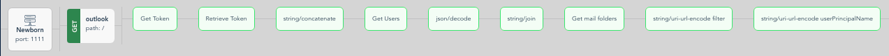
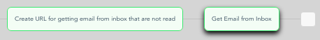
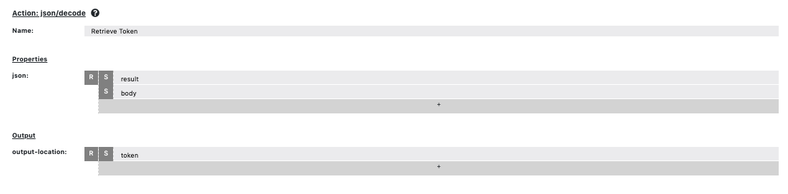
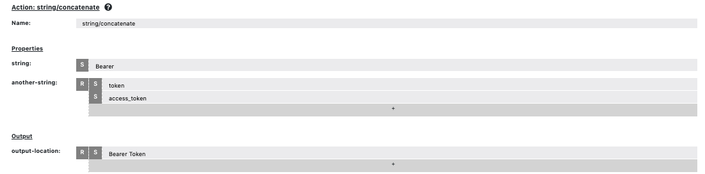
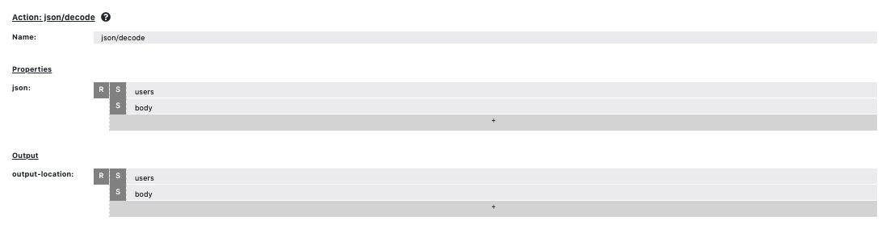
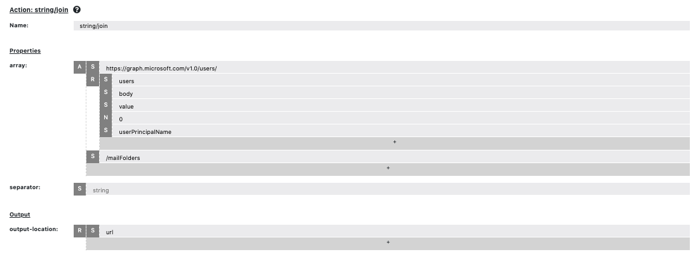
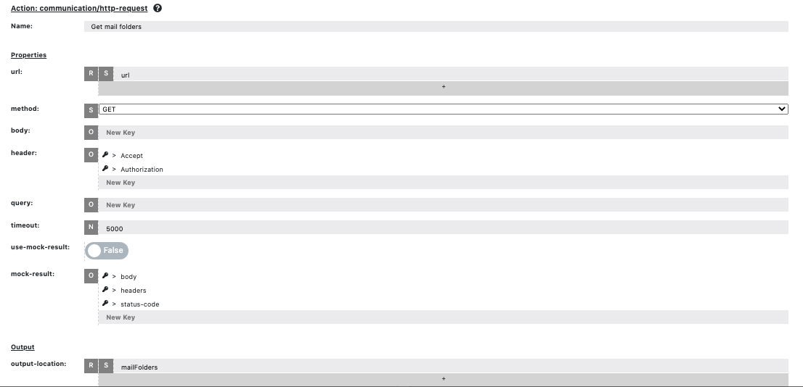
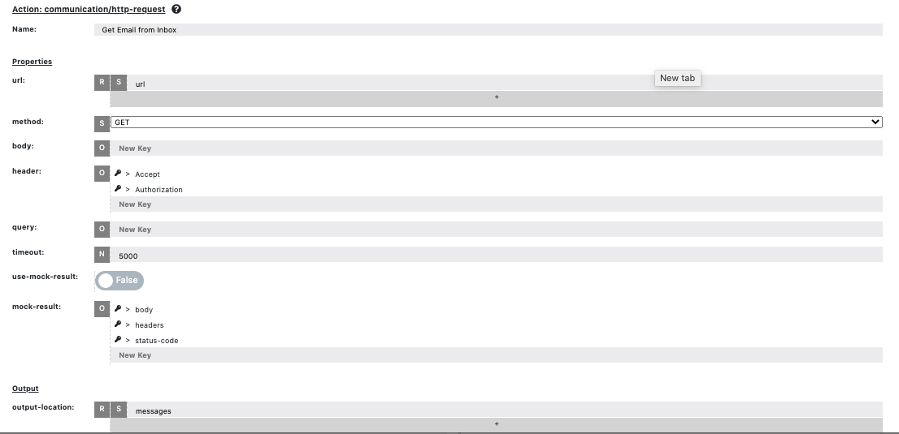

# Summary
* Integrate with Outlook API
* Get emails from Outlook inbox

# API AutoFlow Version:
Configuration config.json was created using AutoFlow version __0.2.9__

# Need help?
Is you have questions about this example, feel free to post your question on the community "<a href="https://interactor.com/autoflow/questions" target="_blank">Ask Questions</a>" website.

# Outlook integration + Data extraction

## Flow overview
1. HTTP Server
2. Endpoint (Method: GET)
3. Action __communication/http-request__ to make the HTTP API call to Outlook and get the token
4. Action __json/decode__ to make the JSON easier to use and retrieve the token
5. Action __string/concatenate__ to join strings "Bearer" and "access_token"
6. Action __communication/http-request__ to get users by calling Microsoft Graph
7. Action __json/decode__ to make the JSON easier to use
8. Action __string/join__ to combine the values into an url
9. Action __communication/http-request__ to get the mail folders
10. Action __string/uri-url-encode__ to enconde "filter" as an url
11. Action __string/uri-url-encode__ to encode the email as an url
12. Action __string/join__ to create an url getting unread emails from inbox
13. Action __communication/http-request__ to get the emails from inbox

## Step 1. Make HTTP API Call to Outlook
Here we want to call the Outlook API to get the Token.
The returned data is stored in a new variable called "result"

## Step 2. Decode JSON data
Outlook returns the data in JSON format. We can use the json/decode action to put the retrieved Token in a more accessible format.

## Step 3. Concatenate Strings
Use this action to join the strings "Bearer" and the "access_token". Output will be Bearer Token.

## Step 4. Get Users
Here we call Microsoft Graph to get the profile of a specific user.
The value is stored in a new variable called "users".

## Step 5. Decode JSON data
Outlook returns the data in JSON format. We can use the json/decode action to put the returned data in a more accessible format.

## Step 6. String Join
Join the results by using the action string/join. The result will be in the variable url.

## Step 7. Get Mail Folders
Use the URL from the previous action to get access to the mail folders.

## Step 8. URI-URL_Encode
Use the srting/uri-url-encode for both the filter "isRead eq false" and the userPrincipal name (the user's email).

## Step 9. Create URL for unread emails from inbox
Use the action string/join to combine userPrincipalName and the Filter. The result will come in the variable "url".

## Step 10. Get email from inbox
Call the Outlook API with the variable "url". The result should be stored on the variable "messages."

## Configuring Outlook API

For Additional help on Asana API:
https://docs.microsoft.com/en-us/graph/auth-v2-service
